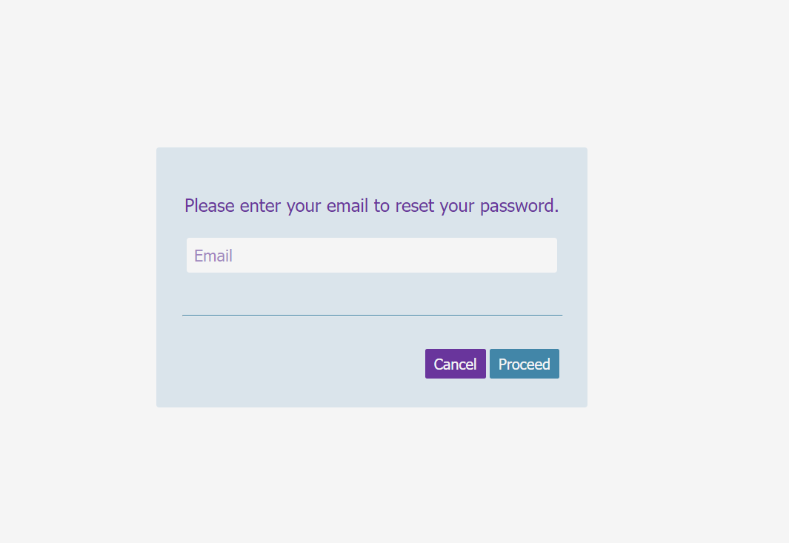
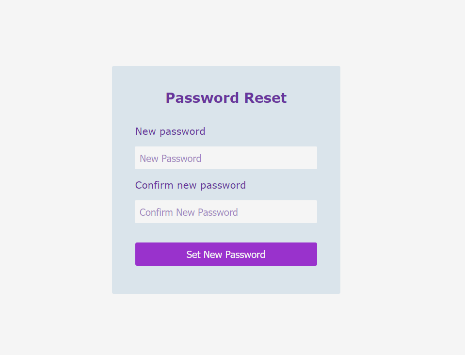
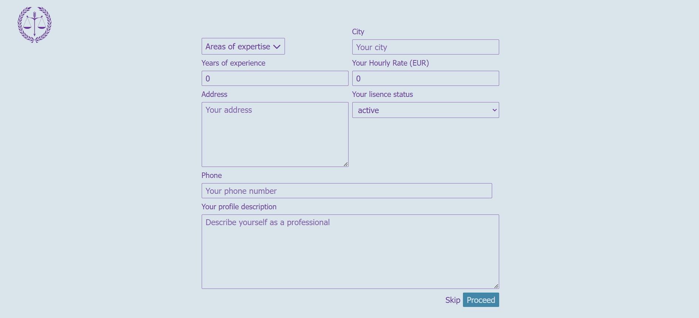
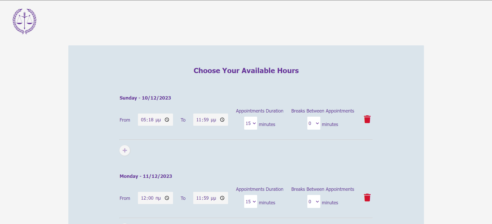

# Lawyers Appointment App

A platform for booking appointments with registered lawyers and legal advisors, built in Django.

[View Live Web App](https://lawyer-appointment-app.onrender.com)

|Front Page|
|:-:|
||

## Main Technologies

- Python
- Django
- PostgreSQL
- Django channels (websockets)
- Vanilla JavaScript

## Features

### Shortcuts

&nbsp;&nbsp;&nbsp;&nbsp;[Login/Register](#loginregister)\
&nbsp;&nbsp;&nbsp;&nbsp;[Reset Password](#reset-password)\
&nbsp;&nbsp;&nbsp;&nbsp;[Lawyer's Info](#lawyers-info)\
&nbsp;&nbsp;&nbsp;&nbsp;[Lawyer's Available Hours](#lawyers-available-hours)

#### Login/Register
&nbsp;&nbsp;&nbsp;&nbsp;A user can register with **username/password** or **google account**.

||
|:-:|
||

&nbsp;&nbsp;&nbsp;&nbsp;The user can choose between registering as a **client** or a **lawyer**.

|||
|:-:|:-:|
|||

#### Reset password

&nbsp;&nbsp;&nbsp;&nbsp;In case a user has registered with username/password, he/she can reset the password if he/she forgot it.

|||
|:-:|:-:|
|||

#### Lawyer's Info

&nbsp;&nbsp;&nbsp;&nbsp;If a user registers as a lawyer, he/she is redirected to a screen to add some informations regarding his/her qualifications as a lawyer/legal advisor.

||
|:-:|
||

#### Lawyer's Available Hours

&nbsp;&nbsp;&nbsp;&nbsp;After the lawyer fills up his/her information, he/she is redirected to a page to choose the hours that he/she is available for the next 2 weeks, the appointments' duration and the breaks in between. Then, the algorithm generates the available appointments, which can be chosen by a client. 

||
|:-:|
||