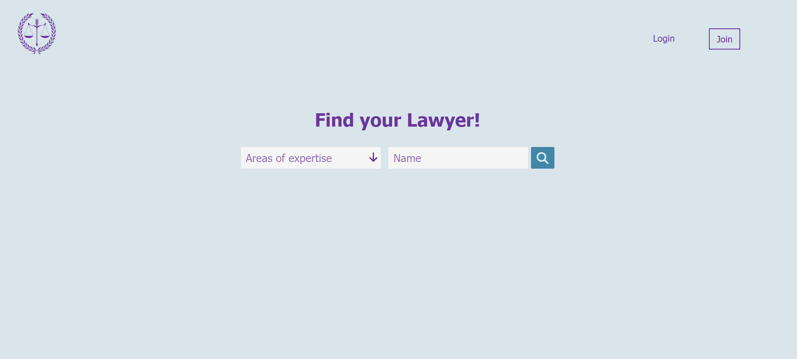
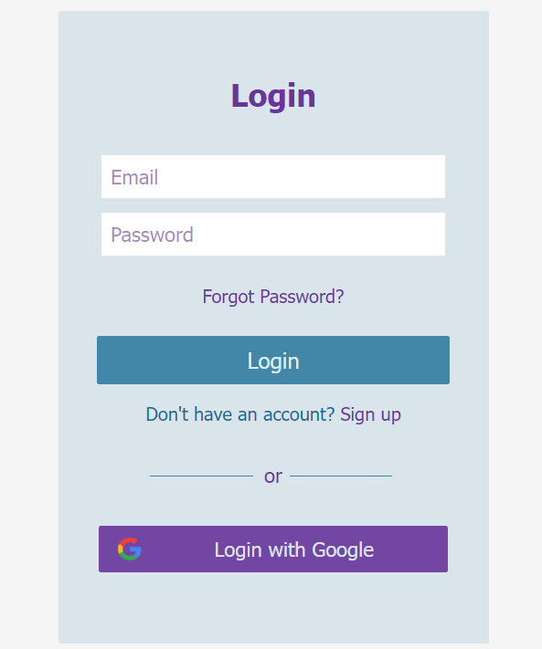
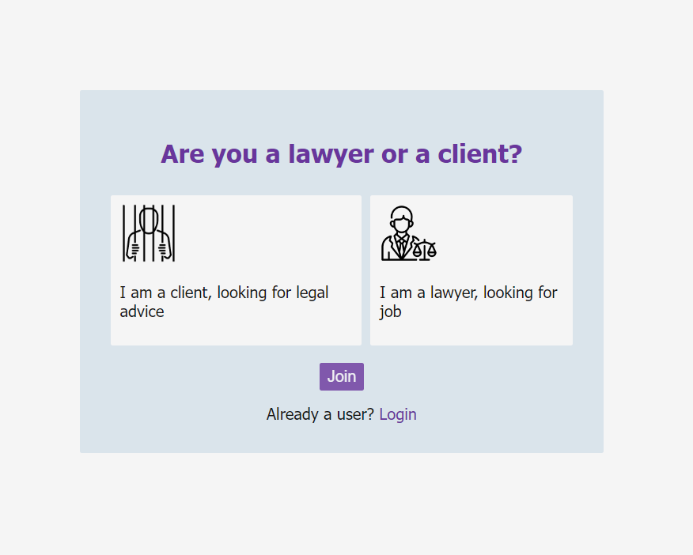
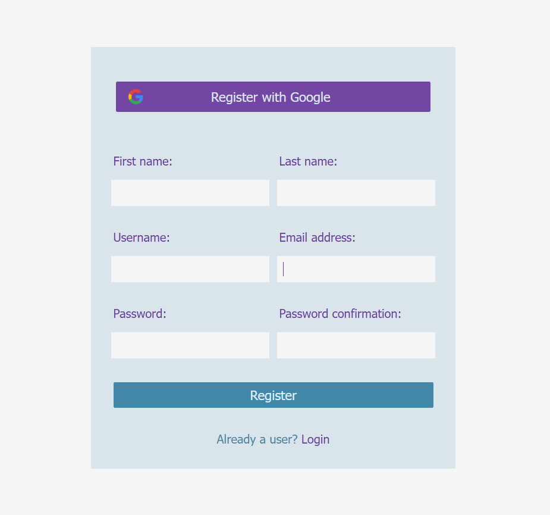

# Lawyers Appointment App

A platform for booking appointments with registered lawyers and legal advisors, built in Django.

[View Live Web App](https://lawyer-appointment-app.onrender.com)

## Index

&nbsp;&nbsp;&nbsp;&nbsp;[Main technologies](#maintechnologies)\
&nbsp;&nbsp;&nbsp;&nbsp;[Features](#features)

## Main Technologies

- Python
- Django
- PostgreSQL
- Django channels (websockets)
- Vanilla JavaScript

## Features

### Shortcuts

&nbsp;&nbsp;&nbsp;&nbsp;[Login/Register](#loginregister)\
&nbsp;&nbsp;&nbsp;&nbsp;[Reset Password](#reset-password)

#### Login/Register
&nbsp;&nbsp;&nbsp;&nbsp;A user can register with **username/password** or **google account**.

&nbsp;&nbsp;&nbsp;&nbsp;The user can choose between registering as a **client** or a **lawyer**.

|Question Specialty|Register|
|:-:|:-:|
|||

#### Reset password

&nbsp;&nbsp;&nbsp;&nbsp;In case a user has registered with username/password, he/she can reset the password if he/she forgot it.