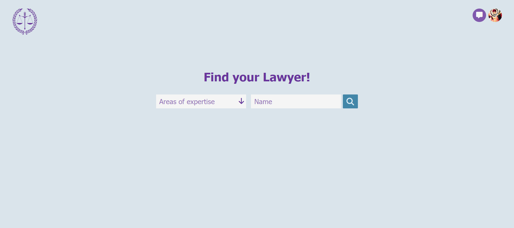
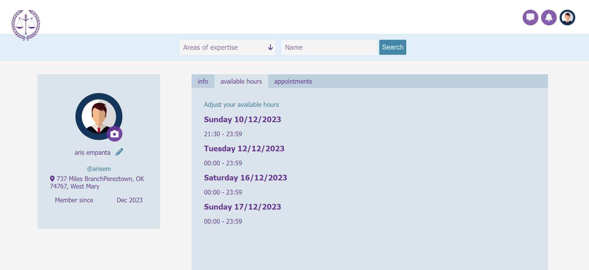

# User's Guide

A Django-based platform designed for scheduling appointments with registered lawyers and legal advisors.

[View Live Web App](https://lawyer-appointment-app.onrender.com)

|Front Page|
|:-:|
||

## Main Technologies

- Python
- Django
- PostgreSQL
- Redis (message broker)
- Django channels (websockets)
- Faker
- Vanilla JavaScript

## Features

### Shortcuts

&nbsp;&nbsp;&nbsp;&nbsp;[Search Lawyers](#search-lawyers)\
&nbsp;&nbsp;&nbsp;&nbsp;[Login/Register](#loginregister)\
&nbsp;&nbsp;&nbsp;&nbsp;[Reset Password](#reset-password)\
&nbsp;&nbsp;&nbsp;&nbsp;[Lawyer's Info](#lawyers-info)\
&nbsp;&nbsp;&nbsp;&nbsp;[Lawyer's Available Hours](#lawyers-available-hours)\
&nbsp;&nbsp;&nbsp;&nbsp;[User Profile](#user-profile)\
&nbsp;&nbsp;&nbsp;&nbsp;[Update Profile Picture](#update-profile-picture)\
&nbsp;&nbsp;&nbsp;&nbsp;[Book an Appointment](#book-an-appointment)\
&nbsp;&nbsp;&nbsp;&nbsp;[Messaging](#messaging)\
&nbsp;&nbsp;&nbsp;&nbsp;[Cancel Appointment](#cancel-appointment)\
&nbsp;&nbsp;&nbsp;&nbsp;[Rate Lawyer](#rate-lawyer)\
&nbsp;&nbsp;&nbsp;&nbsp;[Delete Account](#delete-account)\
&nbsp;&nbsp;&nbsp;&nbsp;[Fake Users Factory](#fake-users-factory)\
&nbsp;&nbsp;&nbsp;&nbsp;[Remind Appointments](#remind-appointments)\
&nbsp;&nbsp;&nbsp;&nbsp;[Delete Past Appointments](#delete-past-appointments)

#### Search Lawyers
&nbsp;&nbsp;&nbsp;&nbsp;Any visitor of the app, authenticated or not, can browse through all the registered lawyers via a search bar which exists in most of the pages. The search result can be filtered by existing areas of expertise of the lawyer, and/or his/her name. By applying no filter, you can browse through all the registered lawyers. **Pagination** is applied of course:

|||
|:-:|:-:|
|||

||
|:-:|
||

#### Login/Register
&nbsp;&nbsp;&nbsp;&nbsp;A user can register with **username/password** or **google account**.

||
|:-:|
||

&nbsp;&nbsp;&nbsp;&nbsp;The user can choose between registering as a **client** or a **lawyer**.

|||
|:-:|:-:|
|||

#### Reset password

&nbsp;&nbsp;&nbsp;&nbsp;In case a user has registered with username/password, he/she can reset the password if he/she forgot it.

|||
|:-:|:-:|
|||

#### Lawyer's Info

&nbsp;&nbsp;&nbsp;&nbsp;If a user registers as a lawyer, he/she is redirected to a screen to add some informations regarding his/her qualifications as a lawyer/legal advisor.

||
|:-:|
||

#### Lawyer's Available Hours

&nbsp;&nbsp;&nbsp;&nbsp;After the lawyer fills up his/her information, he/she is redirected to a page to choose the hours that he/she is available for the next 2 weeks, the appointments' duration and the breaks in between. Then, the algorithm generates the available appointments, which can be chosen by a client. 

||
|:-:|
||

#### User Profile

&nbsp;&nbsp;&nbsp;&nbsp;Each user's profile looks different, depending on whether they are a client or a lawyer, and it further varies based on whether they are viewing their own profile or that of another user.
If a user check's someone else's profile it looks like this:

|Client's Profile|Lawyer's Profile|
|:-:|:-:|
|||

&nbsp;&nbsp;&nbsp;&nbsp;And if a user check's his own profile ehile logged in it may look like this:
|Own Client's Profile|Own Lawyer's Profile|
|:-:|:-:|
|||

&nbsp;&nbsp;&nbsp;&nbsp;In case the user is a lawyer, he/she can edit his info and his/her available hours from his profile page:

|Edit Info|Set available Hours|
|:-:|:-:|
|||

#### Update Profile Picture

&nbsp;&nbsp;&nbsp;&nbsp;The profile picture of a user can be updated like the user's personal informations. All these pictures are stored in a cloud service called Cloudinary. Once a picture is updated, the previous user's picture is deleted in order to save space.

#### Book an Appointment

&nbsp;&nbsp;&nbsp;&nbsp;An authenticated client can book an appointment with a lawyer. Once an appointment is booked, the lawyer receives a real-time notification via the **WebSocket** protocol using Django Channels and Redis as message broker.

|Book Appointment|Real Time Notification|
|:-:|:-:|
|||

&nbsp;&nbsp;&nbsp;&nbsp;A lawyer can check all his booked appointments by clicking the link in his/her profile page, to navigate to the booked appointments page.

|Booked Appointments Link|Booked Appointments Page|
|:-:|:-:|
|||

#### Messaging

&nbsp;&nbsp;&nbsp;&nbsp;Any authenticated user can send real-time messages to another user via the **WebSocket** protocol using the Django Channels library and Redis as message broker.

|Message notification|Messages Page|
|:-:|:-:|
|||

#### Cancel Appointment

&nbsp;&nbsp;&nbsp;&nbsp;Any of both parties can cancel an appointment. If so, a real time automated chat message is sent to the other party.

|Cancel Appointment|Automated Message|
|:-:|:-:|
|||

#### Rate Lawyer

&nbsp;&nbsp;&nbsp;&nbsp;After the scheduled appointment time has elapsed, clients have a 48-hour window to provide a rating for the lawyer.

|Rate Lawyer Button|Rate Lawyer Modal|
|:-:|:-:|
|||

&nbsp;&nbsp;&nbsp;&nbsp;This ratings can be seen by anyone in the lawyer's profile:

|Lawyer's Ratings|
|:-:|
||

#### Delete Account

&nbsp;&nbsp;&nbsp;&nbsp;A user can permanently delete his/her account. By clicking on the profile pic in navbar, a modal opens, which has a link to the delete account page.

|Delete Account Page|
|:-:|
||

#### Fake Users Factory

&nbsp;&nbsp;&nbsp;&nbsp;In order to test and debug the app, I had to populate the database with fake clients and lawyers. Since I needed a large amount, I used the **Faker** library and created a command with Django in order to generate as many clients and lawyers as I needed. The command can be used in debugging mode by typing: **"python manage.py create_testing_data"**.

#### Remind Appointments

&nbsp;&nbsp;&nbsp;&nbsp;Three hours before an appointment starts, a notification email is sent to the client. This is done by a scheduler that every 15 minutes queries if there are appointments that start within the next 3 hours.

#### Delete Past Appointments

&nbsp;&nbsp;&nbsp;&nbsp;Every day at 23:00, a scheduler deletes all the appointments that have been completed over 1 week before.
